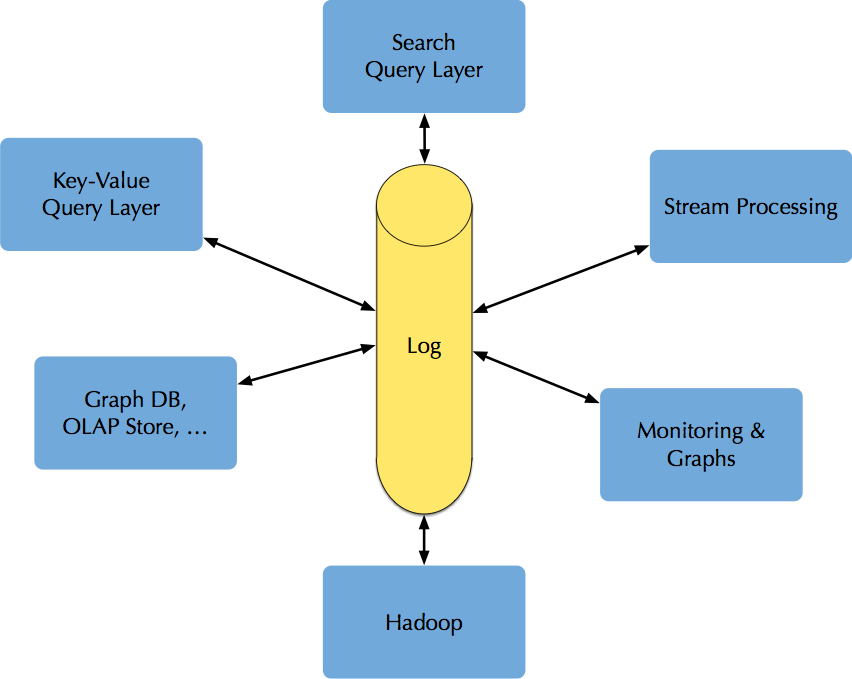
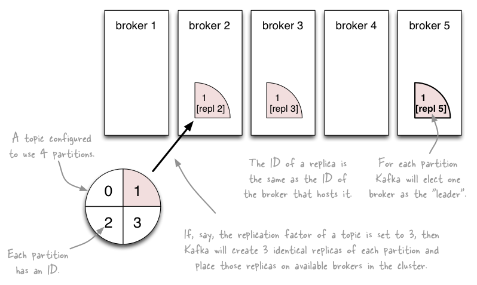
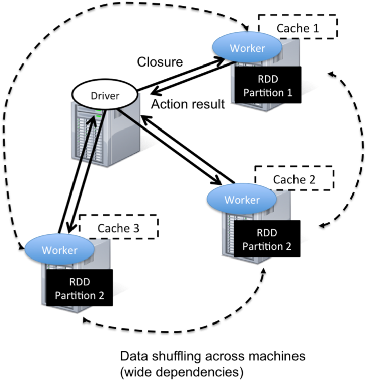
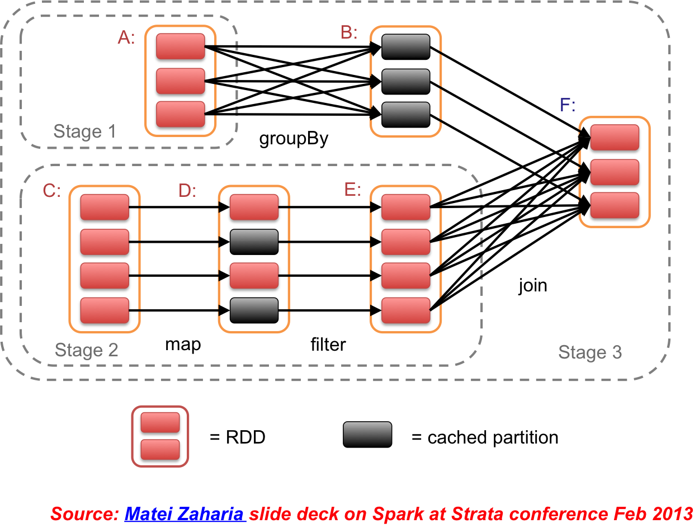

# [fit] Logisland 
## [fit] _**event-mining@scale**_
## @bailetthomas

---

# Schedule

- Introduction
- Core concepts
- Knowledge Paradigm
- Technical stack
- API Design
- Quick start


---

## [fit] Introduction

---

# Logisland Big picture

- **Multi-Purpose** realtime analytics framework
- **High scalability** and **Fault-tolerant**.
- **High throughput** (billions messages / day).
- **Easy** to operate on Hadoop or on **standalone containers**
- **Easily Extensible** to build high level apps
- **Open source**, initiated by Hurence


---

# Use cases

- **Log aggregation** : low latency log processing
- **Stream processing** : multiple stages of processing (enriching, ...)
- **Complex Event processing** : write custom business Rules to generate alerts, for fraud detection
- **click stream tracking** : capture user click stream data
- **SIEM** : security manager for intrusion detection
- **IoT** : generate alerts based on outliers and forecasting.


---

# Challengers
 
- **ELK** is great to start with, but hard to centralize processing and lacks of real offline ML 
- **Splunk** is fantastic but clients are not rich enough to afford it ;)
- **NIFI** is a great tool but doesn't play well with distributed processing 
- **Metron**, **Eagle** are security centric

---

# Features

- **out-of-the-box components** (no code required)
- high level **extensible** framework 
- raw data to structured records automatic **conversion**
- alert percolation or **query matching**
- event **governance** with Avro schema management 
- **online prediction** with offline trained ML models


---

# Features 2

- I/O to Elasticsearch, HBase, HDFS, RocksDB, ...
- telemetry sources (bro, pcap, netflow)
- live enrichement (geoip, custom lookups)
- SQL aggregations
- Time series **sampling**
- Outliers detection
- **Network footprint** clustering


---

## [fit] Core
## [fit] Concepts


---

# [fit] event = 
# [fit] chronological change
# [fit] in the system state


---

# [fit] log = 
# [fit] centralized registry of
# [fit] chronologically ordered events

---

# Log centric architecture



- **async** event production and consumption.
- **uncorrelated** publishers and subscribers.
- acts as a **Messaging system**.
- replay the log from any point in time.
- **realtime** event availability.


---
# [fit] Logisland = 
## [fit] high level stream analytics solution 
## [fit] to handle massive scale
## [fit] event processing


---

## [fit] Pyramidal Knowledge
## [fit] Paradigm

---


## [fit] Logisland continuously transforms  
## [fit] data into information & 
## [fit] information into knowledge 
## [fit] by using asynchronous processing on 
## [fit] increasingly abstract 
## [fit] and meaningful records.

---


###### (credits : David McCandless, Information is Beautiful)

---

# Data Driven Computing


---

## [fit] Technical 
## [fit] Stack 

---

# Technos

- distributed message bus : **Kafka** 
- stream processing : **Spark Streaming** (**Storm** or **KafkaStreams**)
- machine learning : **Spark MLLib**, **DeepLearning4J**
- realtime analytics : **Kibana**
- external backends : **Elasticsearch**, **HBase**, **RocksDb**

---

# Handling distributed logs with Kafka




---

# Kafka architecture


---


# Distribute processing load with Spark

```scala
// load file lines
val lines = spark.sparkContext.textFile("hdfs://...")
// get only those starting with "ERROR"
val errors = lines.filter(_.startWith("ERROR"))
// extract log fields
val messages = errors.map(_.split('\t')(2))
// put those logs in cache
messages.cache()
// get mysql error count
messages.filter(_.contains("mysql")).count()
// get php error count  
messages.filter(_.contains("php")).count()
```



> Cache data => faster results
(1TB processed in 5/7s from cache vs 170s from hd)

---

# Spark lineage graph




---

# Micro-batching with Spark-Streaming


---

# MLLib pipelines


q

---

## [fit] API 
## [fit] Design 

---


---

# Record

The basic unit of processing is the Record.
A ``Record`` is a collection of ``Field``, while a ``Field`` has a ``name``, a ``type`` and a ``value``.


```scala
String id = "firewall_record1";
String type = "cisco";
Record record = new Record(type).setId(id);

assertTrue(record.isEmpty());
assertEquals(record.size(), 0);
```

--- 

# Field

A record holds a collection of fields.

```scala
record.setStringField("url_host", "origin-www.20minutes.fr")
      .setField("method", FieldType.STRING, "GET")
      .setField("response_size", FieldType.INT, 452)
      .setField("is_outside_office_hours", FieldType.BOOLEAN, false)
      .setField("tags",
                FieldType.ARRAY, 
                Arrays.asList("spam", "filter", "mail"));
  
assertEquals( record.getField("method").asString(), "GET");
assertTrue( record.getField("response_size").asInteger() - 452 == 0);
record.removeField("is_outside_office_hours");
assertFalse( record.hasField("is_outside_office_hours"));
```


---

# Special Field

A Record also has some special fields (type, time and id).

```scala
// shortcut for id
assertEquals(record.getId(), id);
assertEquals(record.getField(FieldDictionary.RECORD_ID).asString(), 
             id);

// shortcut for time
assertEquals(record.getTime(), 
  record.getField(FieldDictionary.RECORD_TIME).asLong());

// shortcut for type
assertEquals(record.getType(), type);
```


---

# Field typing and validation

Fields are strongly typed, you can validate them

```scala
Record record = new StandardRecord();
record.setField("request_size", FieldType.INT, 1399);
assertTrue(record.isValid());
    
record.setField("request_size", FieldType.INT, "tom");
assertFalse(record.isValid());
    
record.setField("request_size", FieldType.DOUBLE, 45.5d);
assertTrue(record.isValid());
    
record.setField("request_size", FieldType.STRING, 45L);
assertFalse(record.isValid());
```
    
--- 

# Processor
Logisland is a **component centric** framework, 

It's built over an abstraction layer to build **configurable components**.

A component can be ``Configurable`` and ``Configured``.

The most common component you'll use is the ``Processor`` which 
takes a collection of ``Record`` and publish another collection of records

---
# A configurable component that process Records

```java
public interface Processor extends ConfigurableComponent {
    
  void init(final ProcessContext context);
    
  Collection<Record> process(ProcessContext context, 
                             Collection<Record> records);
}
```
    
---

# SplitText implementation
Define PropertyDescriptor to handle components config.

```java
@Tags({"parser", "regex", "log", "record"})
@CapabilityDescription("This is a processor that is used ...")
@DynamicProperty(name = "alternative regex & mapping",   ...)
public class SplitText extends AbstractProcessor {

    public static final PropertyDescriptor VALUE_REGEX = 
      new PropertyDescriptor.Builder()
            .name("value.regex")
            .description("the regex to match for the message value")
            .required(true)
            .addValidator(StandardValidators.NON_EMPTY_VALIDATOR)
            .build();
    ...
}
```

---
# SplitText config 
Use the components with simple yaml blocs.

```
- processor: apache_parser
  component: com.hurence.logisland.processor.SplitText
  type: parser
  documentation: a parser for apache log REGEX
  configuration:
    record.type: apache_log
    value.regex: (\S+)\s+(\S+)\s+(\S+)\s+\[([\w:\/] ...
    value.fields: src_ip,identd,user,record_time,http_method, ...
```

---

# Stream

a record ``Stream`` basically :

- is a configurable Component
- reads a distributed collection of ``Record`` from Kafka input topics
- transmits them to a chain of ``Processor``
- write the output collection of ``Record`` to some Kafka output topics

    
---

# Streaming paradigm

You can handle partionned data in 2 ways :

- **fully in parrallel**, eg. a thread by partition, like with ``KafkaRecordStreamParallelProcessing``, when records have no link with each other
- by **joining partitions** like with ``KafkaRecordStreamSQLAggregator`` or ``KafkaRecordStreamHDFSBurner`` when you need to join related records (costly join and shuffling operations)

---
# Sample Stream configuration
Define a processing pipeline

```
    - stream: parsing_stream
      component: com.hurence.logisland.stream.spark.KafkaRecordStreamParallelProcessing
      type: stream
      documentation: a processor that links
      configuration:
        kafka.input.topics: logisland_raw
        kafka.output.topics: logisland_events
        kafka.error.topics: logisland_errors
        kafka.input.topics.serializer: none
        kafka.output.topics.serializer: com.hurence.logisland.serializer.KryoSerializer
        kafka.error.topics.serializer: com.hurence.logisland.serializer.JsonSerializer
        ...
      processorConfigurations:
```

---

# Engine

- The ``Engine`` manage a collection of ``Stream``
- this is the abstraction of the execution model, mainly in Spark actually but plans are to integrate Beam to move on Storm and Kafka Streams
- you configure here your Spark job parameters


---
# Sample engine configuration

Define a processing job

```
    engine:
      component: com.hurence.logisland.engine.spark.KafkaStreamProcessingEngine
      type: engine
      documentation: Index some apache logs with logisland
      configuration:
        spark.app.name: IndexApacheLogsDemo
        spark.master: yarn-cluster
        spark.driver.memory: 1G
        spark.driver.cores: 1
        spark.executor.memory: 2G
        spark.executor.instances: 4
        spark.executor.cores: 2
        spark.yarn.queue: default
        ...
      streamConfigurations:
```


---
# Transverse service injection : ControllerService

we often need to share access to external Services across the Processors, for example 

- bulk buffers or client connections to external data 
- a cache service that could cache K/V tuple across the worker node.

---
# Sample ControllerService component


We need to provide an interface API for this service :

``` java

    public interface CacheService<K,V> extends ControllerService {

        PropertyDescriptor CACHE_SIZE = new PropertyDescriptor.Builder()
                .name("cache.size")
                .description("The maximum number of element in the cache.")
                .required(false)
                .defaultValue("16384")
                .addValidator(StandardValidators.POSITIVE_INTEGER_VALIDATOR)
                .build();

        public V get(K k);

        public void set(K k, V v);
    }
```

---
# Inject service in Processor

You can then use this service in a custom processor :

```java
    public class TestProcessor extends AbstractProcessor {

        static final PropertyDescriptor CACHE_SERVICE = new PropertyDescriptor.Builder()
                .name("cache.service")
                .description("CacheService")
                .identifiesControllerService(CacheService.class)
                .required(true)
                .build();

        @Override
        public boolean hasControllerService() {
            return true;
        }
    }
```

---

# Define service in config

The injection is done through yaml config files by injecting the instance of `lru_cache` Service.

```
      controllerServiceConfigurations:

        - controllerService: lru_cache
          component: com.hurence.logisland.service.elasticsearch.LRUKeyValueCacheService
          configuration:
            cache.size: 5000

      streamConfigurations:
        - stream: parsing_stream

          processorConfigurations:
            - processor: mock_processor
              component: com.hurence.logisland.processor.TestProcessorhing
              configuration:
                 cache.service: lru_cache
```

---

## [fit] Quick 
## [fit] Start


---

# Getting started (Hadoop cluster)

Download the latest release from [github](https://github.com/Hurence/logisland/releases)

	tar -xzf logisland-0.10.1-bin.tar.gz

Create a job configuration

    vim conf/index-apache-logs.yml

Run the job

    export SPARK_HOME=/usr/hdp/current/spark-client
    bin/logisland.sh --conf conf/index-apache-logs.yml

--- 

# Getting started (lightweight container)

Pull & run the image from Docker Repository

    docker pull hurence/logisland
    docker run  -it --name logisland \
        -p 8080:8080 -p 5601:5601 -p 9200:9200 \
        -h sandbox  hurence/logisland bash

Run the job

    bin/logisland.sh --conf conf/index-apache-logs.yml


---

## [fit] Next ?

---

# Roadmap

- MLLib components wrappers
- visual Stream configuration / dashboards through Ambari views
- Auto-scaling to optimize cluster resources 
- Density based automatic system usage profiling 
- Pattern discovery through Deep Learning
- vertical bundles (cybersecurity, fraud, ...)

---
# Resources

- **source** : [https://github.com/Hurence/logisland/releases](https://github.com/Hurence/logisland/releases)
- **Docker** : [https://hub.docker.com/r/hurence/logisland/tags/](https://hub.docker.com/r/hurence/logisland/tags/)
- **Documentation** : [http://logisland.readthedocs.io/en/latest/concepts.html](http://logisland.readthedocs.io/en/latest/concepts.html)
- **support** : [https://gitter.im/logisland/logisland](https://gitter.im/logisland/logisland)
- **contact** : bailet.thomas@gmail.com

-------------------------

## [fit] Q&A