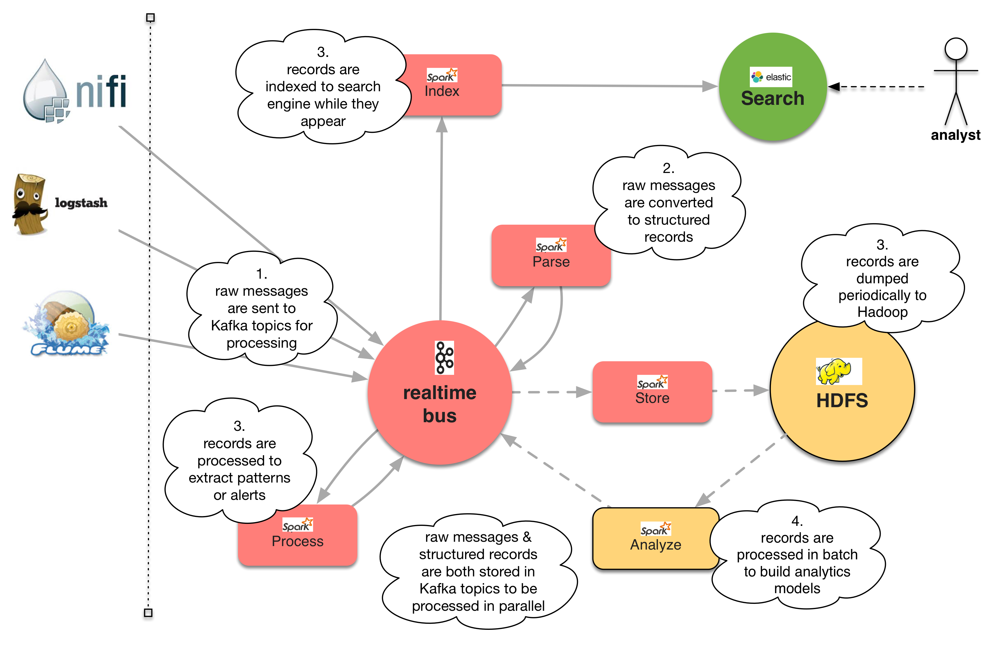

# [fit] Logisland 
## [fit] _**Event mining at scale**_
### Thomas Bailet @hurence [2017-01-19]

---

## [fit] Overview

---
# [fit] Logisland
## [fit] provides a stream analytics solution 
## [fit] that can handle all enterprise-scale
## [fit] event data and processing

---

# Big picture

- **Open source**, developed by Hurence, implemented at lfdj.fr
- **High scalability** and **Fault-tolerant**.
- **High throughput** (billions messages / day).
- **Easy** to operate on Hadoop or on standalone containers
- **Extensible framework** to build high level apps
- Alternative to Splunk, StreamAnalytix, ...

---

# Purpose

- log mining
- complex event processing
- patterns finding
- reframing
- normalizing
- contextualizing

---

---

# Why ?

- lot of historical code with elasticsearch, **Pig**, **Mahout** before **Spark** & **Kafka**  
- **ELK** is great to start, but hard to centralize processing and lacks of offline ML 
- **Splunk** is fantastic but clients are not rich enough to afford it ;)
- **NIFI** is a great tool but doesn't play well with distributed processing 
- **Metron**, **Eagle** are too security centric

---

# Features

- out-of-the-box processors (no code required)
- raw data to structured records conversion
- store to HDFS for offline analysis
- records indexation for realtime search
- alert percolation or query matching

---

# Features 2

- high level extensible framework  
- stream governance with Avro schema management 
- SQL aggregations
- Time series sampling 
- Outliers detection
- Network footprint clustering

---

## [fit] Paradigm

---

## [fit] Logisland continously transforms  
## [fit] data into information & 
## [fit] information into knowledge 
## [fit] by using asynchronous processing on 
## [fit] increasingly abstract 
## [fit] and meaningfull records.

---

---

# La française des jeux sample

Example of one production cluster 

- 5 brokers
- 2000 partitions (replication factor 3)
- 100 000 msg/s

---

# Use cases

- **Log aggregation** : low latency processing over mutliple log datasources
- **Stream processing** : multiple stages of processing (enriching, ...)
- **Complex Event processing** : write custom business Rules to generate alerts, for fraud detection
- **click stream tracking** : capture user click stream data
- **SIEM** : security manager for intrusion detection
- **IoT** : generate alerts based on outliers and forcasting.

---

## [fit] Design 

---

---

# Record

The basic unit of processing is the Record.
A ``Record`` is a collection of ``Field``, while a ``Field`` has a ``name``, a ``type`` and a ``value``.

    String id = "firewall_record1";
    String type = "cisco";
    Record record = new Record(type).setId(id);

    assertTrue(record.isEmpty());
    assertEquals(record.size(), 0);

---

A record is defined by its type and a collection of fields. 
There are three special fields:

    // shortcut for id
    assertEquals(record.getId(), id);
    assertEquals(record.getField(FieldDictionary.RECORD_ID).asString(), id);

    // shortcut for time
    assertEquals(record.getTime().getTime(), 
        record.getField(FieldDictionary.RECORD_TIME).asLong().longValue());

    // shortcut for type
    assertEquals(record.getType(), type);

--- 
And the *standard* fields have generic setters, getters and removers

    record.setStringField("url_host", "origin-www.20minutes.fr")
          .setField("method", FieldType.STRING, "GET")
          .setField("response_size", FieldType.INT, 452)
          .setField("is_outside_office_hours", FieldType.BOOLEAN, false)
          .setField("tags",
                    FieldType.ARRAY, 
                    Arrays.asList("spam", "filter", "mail"));
  
    assertEquals(record.getField("method").asString(), "GET");
    assertTrue(record.getField("response_size").asInteger() - 452 == 0);
    record.removeField("is_outside_office_hours");
    assertFalse(record.hasField("is_outside_office_hours"));

---
Fields are strongly typed, you can validate them

    Record record = new StandardRecord();
    record.setField("request_size", FieldType.INT, 1399);
    assertTrue(record.isValid());
    
    record.setField("request_size", FieldType.INT, "zer");
    assertFalse(record.isValid());
    
    record.setField("request_size", FieldType.DOUBLE, 45.5d);
    assertTrue(record.isValid());
    
    record.setField("request_size", FieldType.STRING, 45L);
    assertFalse(record.isValid());
    
--- 

# Processor
Logisland is a component centric framework, 

It's built over an abstraction layer to build configurable components.

A component can be ``Configurable`` and ``Configured``.

The most common component you'll use is the ``Processor`` which 
takes a collection of ``Record`` and publish another collection of records

---

    public interface Processor extends ConfigurableComponent {
    
        /**
         * Setup stateful parameters
         */
        void init(final ProcessContext context);
    
        /**
         * Process the incoming collection of records to
         * generate a new collection of records
         */
        Collection<Record> process(ProcessContext context, 
                                   Collection<Record> records);
    }
---
# Sample Processor config

    - processor: apache_parser
      component: com.hurence.logisland.processor.SplitText
      type: parser
      documentation: a parser for apache log REGEX
      configuration:
        record.type: apache_log
        value.regex: (\S+)\s+(\S+)\s+(\S+)\s+\[([\w:\/] ...
        value.fields: src_ip,identd,user,record_time,http_method, ...

---

# Stream

a record ``Stream`` basically :

- reads a distributed collection of ``Record`` from Kafka input topics
- transmits them to a chain of ``Processor``
- write the output collection of ``Record`` to some Kafka output topics

---

    public interface RecordStream extends ConfigurableComponent {
    
        /**
         * start the stream processing
         */
        void start();
    
        /**
         * stop the stream processing
         */
        void stop();
    }
    
---

# Streaming paradigm

You can handle partionned data in 2 ways :

- **fully in parrallel**, eg. a thread by partition, like with ``KafkaRecordStreamParallelProcessing``, when records have no link with each other
- by **joining partitions** like with ``KafkaRecordStreamSQLAggregator`` or ``KafkaRecordStreamHDFSBurner`` when you need to join related records (costly join and shuffling operations)

---
# Sample Stream configuration

    - stream: parsing_stream
      component: com.hurence.logisland.stream.spark.KafkaRecordStreamParallelProcessing
      type: stream
      documentation: a processor that links
      configuration:
        kafka.input.topics: logisland_raw
        kafka.output.topics: logisland_events
        kafka.error.topics: logisland_errors
        kafka.input.topics.serializer: none
        kafka.output.topics.serializer: com.hurence.logisland.serializer.KryoSerializer
        kafka.error.topics.serializer: com.hurence.logisland.serializer.JsonSerializer
        ...
      processorConfigurations:

---

# Engine

The ``Engine`` manage a collection of ``Stream``

this is the abstraction of the execution model, mainly in Spark actually but plans are to integrate Beam to move on Storm and Kafka Streams

you configure here your Spark job parameters

---

    /**
     * Carry the whole workload of processing
     */
    public interface ProcessingEngine extends ConfigurableComponent {
    
        /**
         * start the engine with a context
         *
         * @param engineContext
         */
        void start(EngineContext engineContext);
    
        /**
         * shutdown the engine with a context
         * @param engineContext
         */
        void shutdown(EngineContext engineContext);
    
    }

---
# Sample engine configuration

    engine:
      component: com.hurence.logisland.engine.spark.KafkaStreamProcessingEngine
      type: engine
      documentation: Index some apache logs with logisland
      configuration:
        spark.app.name: IndexApacheLogsDemo
        spark.master: yarn-cluster
        spark.driver.memory: 1G
        spark.driver.cores: 1
        spark.executor.memory: 2G
        spark.executor.instances: 4
        spark.executor.cores: 2
        spark.yarn.queue: default
        ...
      streamConfigurations:
      
---

## [fit] quick start

---

# Getting started (Hadoop cluster)

Download the latest release from [github](https://github.com/Hurence/logisland/releases)

	tar -xzf logisland-0.10.3-bin.tar.gz

Create a job configuration

    vim conf/index-apache-logs.yml

Run the job

    export SPARK_HOME=/usr/hdp/current/spark-client
    bin/logisland.sh --conf conf/index-apache-logs.yml

--- 

# Getting started (lightweight container)

Pull & run the image from Docker Repository

    docker pull hurence/logisland
    docker run  -it --name logisland \
        -p 8080:8080 -p 5601:5601 -p 9200:9200 \
        -h sandbox  hurence/logisland bash

Run the job

    bin/logisland.sh --conf conf/index-apache-logs.yml

--- 

# Step 4 : Play with your data

---

## [fit] Next ?

---

# Roadmap

- Ambari Agent for job dynamic interaction (REST Api)
- visual Stream configuration / dashboards through Ambari views
- Auto-scaling to optimize cluster resources 
- Density based automatic Usage profiling 
- Pattern discovery through Deep Learning
- App store, per use-case knowledge bundles (cybersecurity, fraud, ...)

---
# Resources

- **source** : [https://github.com/Hurence/logisland/releases](https://github.com/Hurence/logisland/releases)
- **Docker** : [https://hub.docker.com/r/hurence/logisland/tags/](https://hub.docker.com/r/hurence/logisland/tags/)
- **Maven** : [https://search.maven.org/#search%7Cga%7C1%7Clogisland](https://search.maven.org/#search%7Cga%7C1%7Clogisland)
- **Documentation** : [http://logisland.readthedocs.io/en/latest/concepts.html](http://logisland.readthedocs.io/en/latest/concepts.html)
- **support** : [https://gitter.im/logisland/logisland](https://gitter.im/logisland/logisland)
- **contact** : thomas.bailet@hurence.com

-------------------------

## [fit] Questions ?

---

